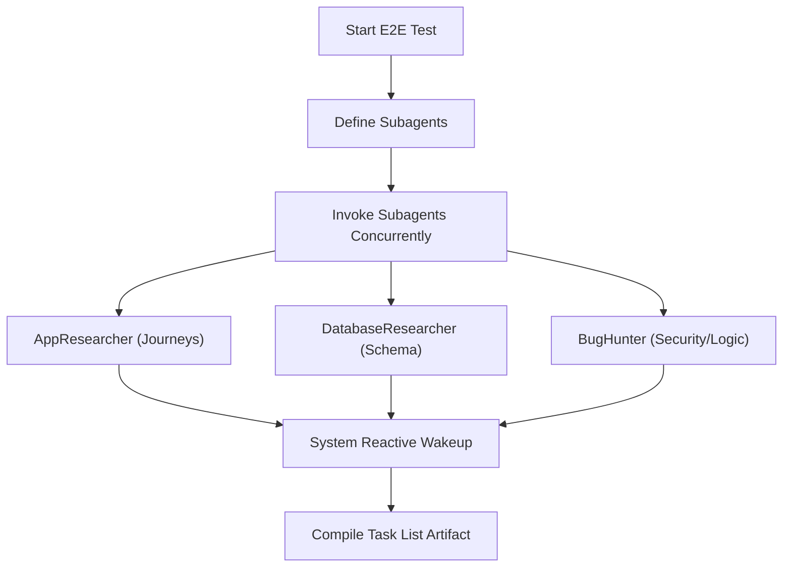

# End-to-End Testing Workflow for Antigravity

This workflow outlines how the Antigravity agent can coordinate a thorough, professional, and parallelized End-to-End (E2E) UI and database test of the local codebase.

---

## Phase 1: Environment & Tooling Verification

### 1. Platform Check
Verify that the workspace operating system supports headless browser automation. Run:
```bash
uname -s
```
- Returns `Linux` or `Darwin` (macOS) $\rightarrow$ Proceed.
- Returns anything else $\rightarrow$ Output warning: "agent-browser requires macOS, Linux, or WSL. If running on native Windows, please switch to a WSL terminal."

### 2. Check & Install `agent-browser`
Check if the browser CLI is installed:
```bash
agent-browser --version
```
If not installed, execute these commands in order:
```bash
# Install globally
npm install -g agent-browser

# Install browser dependencies
agent-browser install --with-deps
```

### 3. Identify Frontend Web Setup
Ensure there is a front-end server configuration (e.g. `package.json` with `next dev` or `vite`, `pyproject.toml` with `uvicorn`, etc.).

---

## Phase 2: Parallel Analysis (Exploiting Antigravity Subagents)

To save time and build deep context, **define and spawn three specialized subagents simultaneously** using Antigravity's `define_subagent` and `invoke_subagent` tools.



### Subagent Prompts & Configurations:

#### Subagent 1: `AppResearcher`
- **Role**: Codebase Researcher
- **Prompt**:
  > Analyze the workspace codebase recursively. Return a structured report covering:
  > 1. Exact commands to install packages, build the app, and launch the dev server (including ports/URLs).
  > 2. The authentication setup: is there signup, login, OAuth, or seed credentials?
  > 3. List of all user-facing URL routes.
  > 4. List of 3-5 comprehensive user journeys (e.g. "Anonymous user signs up, edits profile, uploads an avatar, and views public profile"). Identify specific pages and button clicks.

#### Subagent 2: `DatabaseResearcher`
- **Role**: Database Architect
- **Prompt**:
  > Research the database structure of the codebase. Read environment variable files (e.g., `.env.example`).
  > 1. Identify the database engine (PostgreSQL, SQLite, MySQL, Redis) and connection variable names.
  > 2. Document the full schema (tables, columns, data types, primary/foreign keys).
  > 3. Provide exact SQL commands or scripts to verify that data has been correctly inserted, updated, or deleted for core user actions (e.g., user registration, creating a ticket).

#### Subagent 3: `BugHunter`
- **Role**: Security & Logic Auditor
- **Prompt**:
  > Audit the codebase for potential logic bugs, security vulnerabilities (SQLi, XSS, CSRF), missing inputs validation, race conditions, or unhandled exceptions.
  > Provide a prioritized list with exact file paths and line numbers.

### Execution Flow:
1. Define the subagents using `define_subagent`.
2. Launch them concurrently using a single call to `invoke_subagent` with `Workspace: 'share'` so they operate on the shared workspace.
3. Use **Reactive Wakeup**: Do not call any tools. Stop execution and wait. The system will automatically wake Antigravity up when all subagents send their reports. If needed, schedule a 2-minute timer with `schedule` as a backup.

---

## Phase 3: Launching the App & Initializing Task List

### 1. Compile E2E Task List Artifact
Create a progress tracking file: `.antigravity/plans/e2e-testing-progress.md`.
- Use `write_to_file` with `IsArtifact: true` and `ArtifactType: 'task'`.
- Define checkboxes for every user journey mapped by `AppResearcher` and every potential bug path identified by `BugHunter`.

### 2. Start the Dev Server in the Background
Using the instructions from `AppResearcher`, start the database and web server:
- Execute `run_command` to launch the dev server (e.g., `npm run dev`).
- **Antigravity Task Boundary**: Set `WaitMsBeforeAsync` to `5000` (5 seconds) so that the server spins up and then shifts into a background task managed by `manage_task`.
- Verify the server is running by executing:
  ```bash
  curl -s http://localhost:3000/health  # Replace with actual URL/port
  ```

---

## Phase 4: Visual & Structural User Journey Testing

For each E2E journey in the task list:

### 1. Browser Simulation
Interact with the browser using `agent-browser` via `run_command`:
```bash
# Navigate to target page
agent-browser open http://localhost:3000/login

# Capture available interactive elements
agent-browser snapshot -i

# Fill form inputs and click buttons using @e references
agent-browser fill @e1 "user@domain.com"
agent-browser fill @e2 "password123"
agent-browser click @e3

# Wait for page transitions or API calls to settle
agent-browser wait --load networkidle
```

### 2. Visual Capture & Analysis
- Capture high-resolution screenshots for every critical interaction state (e.g., Form Filled, Success State, Modal Opened):
  ```bash
  agent-browser screenshot e2e-screenshots/journey-1/01-logged-in.png
  ```
- Use Antigravity's `view_file` to inspect the generated screenshot. Make sure there are no visual overlaps, rendering bugs, hidden elements, or unresponsive layouts.

### 3. Database Integrity Check
After an action that modifies state (e.g. creating a ticket, updating settings), query the local database to verify correctness:
- **PostgreSQL**:
  ```bash
  psql "$DATABASE_URL" -c "SELECT * FROM tickets ORDER BY created_at DESC LIMIT 1;"
  ```
- **SQLite**:
  ```bash
  sqlite3 dev.db "SELECT * FROM tickets ORDER BY id DESC LIMIT 1;"
  ```
Verify the columns, types, references, and ensure no orphaned database rows were created.

### 4. Responsive Viewport Testing & Playwright Runner
Run the native Playwright E2E test suite to execute robust, automated, multi-device viewport tests (Desktop Chrome, Mobile Chrome, and Tablet Safari) in parallel:
```bash
npx playwright test --config=apps/web/playwright.config.ts
```
This automatically captures screenshots, video files, and detailed execution traces.

For one-off visual tests, you can also resize manually via `agent-browser`:
- **Mobile**: `agent-browser set viewport 375 812` (Take screenshots)
- **Tablet**: `agent-browser set viewport 768 1024` (Take screenshots)
- **Desktop**: `agent-browser set viewport 1440 900` (Take screenshots)

---

## Phase 5: Cleanup & Deactivation

When all testing tasks are completed:
1. Close browser sessions:
   ```bash
   agent-browser close
   ```
2. Kill the background server task:
   Use `manage_task` with action: `kill` and the `TaskId` of the dev server background process.

---

## Phase 6: Rich Report Generation

Compile results and write a premium visual markdown report to `playwright-e2e-report.md` in the project root as an **artifact** (Set `IsArtifact: true`, `ArtifactType: 'walkthrough'`):

### Required Report Sections:
1. **Summary Cards**: Displays Journeys Tested, Screenshots Captured, and Issues found in clean markdown tables.
2. **Visual Journey Galleries**: Sequential screenshots embedded as markdown images.
3. **CORS & Hydration Checklist**: Checks confirming that CORS is enabled and hydration locks (`isHydrated`) are fully active.
4. **Database Validation Log**: SQL queries executed and tables of their verified results.
5. **Responsive Integrity Review**: Gallery comparing mobile, tablet, and desktop views.
