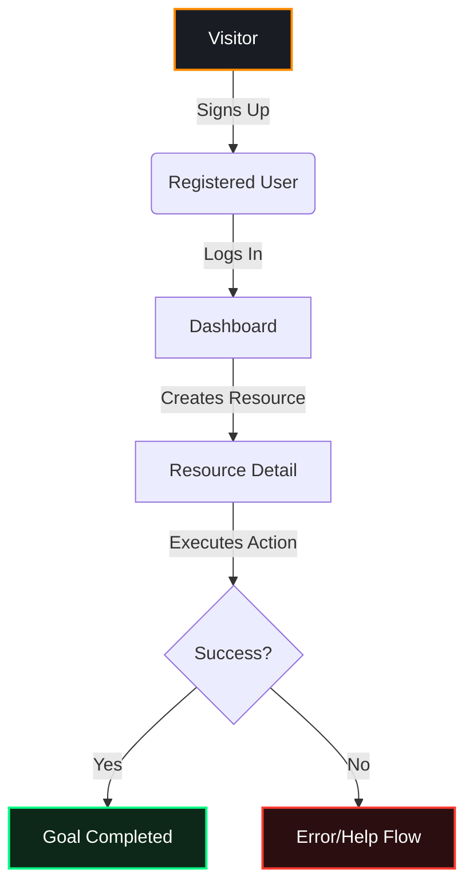
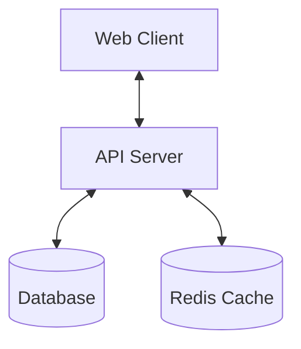

# Product Requirements Document: [Project Name]

> [!NOTE]
> This PRD acts as the source of truth for the product requirements, engineering design, and implementation plan. It is designed to maximize the performance of agentic AI workflows.

---

## 1. Executive Summary

### Overview
<!-- Provide a 2-3 paragraph summary of the product, what problem it solves, and why it is being built. -->
[Write a high-level overview of the product, the target audience, and the key problems it aims to solve.]

### Value Proposition
<!-- Detail why this product exists and how it creates value for its users. -->
[Describe the core value proposition.]

### MVP Success Statement
<!-- A single, clear sentence defining what the Minimum Viable Product must achieve to be considered successful. -->
[Example: The MVP must enable users to sign up, create a profile, upload a document, and get an automated summary within 5 seconds.]

---

## 2. Product Mission & Principles

- **[Principle 1 Name]**: [Description of Principle 1 - e.g., Speed is a Feature: pages must load in under 200ms.]
- **[Principle 2 Name]**: [Description of Principle 2 - e.g., Simplicity First: any user action must be achievable in 3 clicks or less.]
- **[Principle 3 Name]**: [Description of Principle 3 - e.g., Offline capability: core editor features must work without an internet connection.]

---

## 3. User Journey Map
<!-- Map the user flow from discovery to goal completion using a Mermaid diagram. -->

---

## 4. MVP Scope Definition

| System Module | In Scope (✅) | Out of Scope (❌) |
|---------------|---------------|-------------------|
| **Identity & Access** | [e.g. Email/Password auth, session management] | [e.g. OAuth, OAuth2, SSO, MFA] |
| **Core Engine** | [e.g. Create, Read, Update, Delete operations] | [e.g. Bulk upload, automated exports] |
| **User Interface** | [e.g. Mobile-responsive web dashboard] | [e.g. Desktop app, native mobile app] |
| **Notifications** | [e.g. Simple in-app alerts] | [e.g. SMS notifications, email newsletters] |

---

## 5. Functional Specifications & User Stories

### Primary User Stories
1. **As a** visitor, **I want to** sign up for an account, **so that** I can save my work.
   - *Acceptance Criteria*: Form validation, password hashing, automated redirection to login.
2. **As a** user, **I want to** create a new project, **so that** I can organize my tasks.
   - *Acceptance Criteria*: Project naming, creation timestamp, dynamic list rendering.

---

## 6. System Architecture & Tech Stack

### Tech Stack Table
| Component | Technology | Version | Purpose & Rationale |
|-----------|------------|---------|---------------------|
| Runtime | Node.js | v20+ | High-performance, async execution, rich package ecosystem |
| Framework | Express / Next.js | Latest | Industry standard, modular, type-safe API routing |
| Database | PostgreSQL / SQLite | Latest | Relational integrity, ACID compliance |
| ORM | Prisma / Drizzle | Latest | Type-safe queries, migration management |
| Styling | CSS Modules / Vanilla CSS | - | Lightweight, maximum styling control, zero dependencies |

---

## 7. Security & Configuration
- **Authentication**: JWT-based stateless authentication or secure cookies.
- **Environment Variables**: Managed using a `.env` file (never commit to git).
- **Required Variables**:
  - `DATABASE_URL`: Connection string for PostgreSQL/SQLite database.
  - `JWT_SECRET`: Secret key for signing access tokens.

---

## 8. Success Criteria & Metrics

- [ ] **Verification 1**: Zero console errors during start and checkout/operations.
- [ ] **Performance Goal**: Page load times under 300ms, API response times under 100ms.
- [ ] **Test Coverage**: Minimum 80% coverage on core business logic functions.

---

## 9. Phased Implementation Roadmap

### Phase 1: Foundation
- **Goal**: Set up database schemas, models, and initial project configuration.
- [ ] Initialize git, package manager, and TypeScript configuration.
- [ ] Define database models and execute migrations.
- [ ] Create mock data seed script.

### Phase 2: Core Logic
- **Goal**: Implement primary API endpoints and core business logic.
- [ ] Build Authentication flow (Register, Login, Me).
- [ ] Implement CRUD operations for main resources.
- [ ] Write unit tests for core controllers and services.

### Phase 3: Front-End UI
- **Goal**: Build the client interface and integrate with the API.
- [ ] Set up layout structure, design tokens, and components.
- [ ] Implement page routing and navigation.
- [ ] Integrate API endpoints and state management.

### Phase 4: Polish & Integration
- **Goal**: Conduct end-to-end checks, visual styling refinements, and E2E testing.
- [ ] Run complete automated test suites.
- [ ] Optimize database indexes and query performance.
- [ ] Validate responsive layouts and accessibility.

---

## 10. Risks & Mitigation

| Risk | Severity | Mitigation Strategy |
|------|----------|---------------------|
| [e.g. API Rate Limits] | Medium | Implement caching and rate-limiting middleware |
| [e.g. Data Concurrency] | High | Use transactions and row-level locking where necessary |
