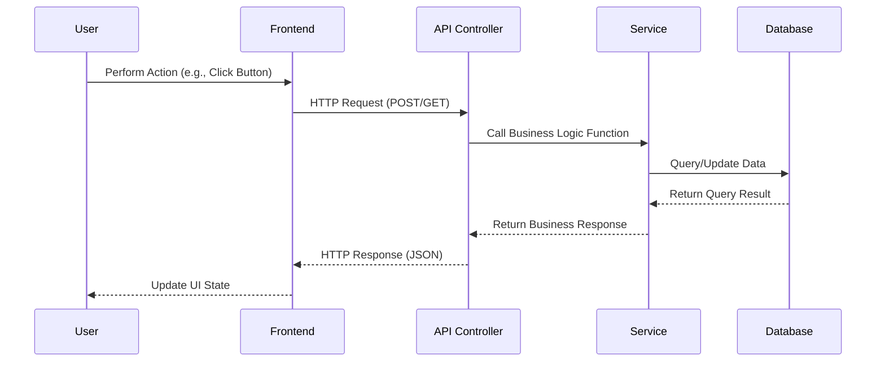

# System Architecture Specification: [Project Name]

This document details the architectural layers, data flows, and design decisions of the system.

---

## 1. Monorepo / Workspace Organization
<!-- Describe how the project directory is organized. If it's a monorepo, list the workspaces. If it's a monolith/single project, list the key modules/directories. -->

```text
[project-root]/
├── src/
│   ├── controllers/    # Route handlers & HTTP boundary
│   ├── services/       # Core business logic
│   ├── models/         # Database models & schemas
│   └── utils/          # Shared helper functions
└── public/             # Static client assets
```

---

## 2. Core Architectural Components
<!-- Outline the main components of the application and their roles. -->

- **API Layer**: Handles HTTP requests, parses payloads, handles authentication, and routes requests to appropriate service handlers.
- **Service Layer**: House of business rules. Independent of specific database clients or transport protocols.
- **Data Access Layer**: Directly interacts with the database (via ORM or raw SQL) to persist and fetch records.
- **Cache Layer**: Keeps session data or frequently read configs ready to decrease load on the database.

---

## 3. Core Data Flow
<!-- Map the data flow using a Mermaid diagram. -->



---

## 4. Key Architectural Patterns
<!-- Document special patterns used in the codebase. Examples:
- Distributed Locking
- Job Queues (BullMQ / Celery)
- Event-Driven Architecture (WebSockets / Event Emitters)
- Optimistic Concurrency Checks
-->

### [Pattern Name 1]
- **Mechanism**: [Describe how it works]
- **Purpose**: [Explain why this pattern was chosen]

### [Pattern Name 2]
- **Mechanism**: [Describe how it works]
- **Purpose**: [Explain why this pattern was chosen]
