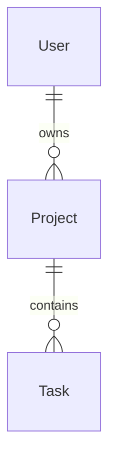

# Database Schema & Data Models Specification

This document details the database schema, models, relational mappings, and index optimizations.

---

## 1. Entity-Relationship Diagram (ERD)
<!-- Sketch out entity relationships using a Mermaid diagram. -->

---

## 2. Model Definitions
<!-- Document the core fields, types, and constraints for each model. -->

### `User`
- `id` (UUID, Primary Key)
- `email` (String, Unique)
- `password` (String, Hashed)
- `createdAt` (DateTime)

### `Project`
- `id` (UUID, Primary Key)
- `name` (String)
- `ownerId` (UUID, Foreign Key referencing `User.id`)
- `createdAt` (DateTime)

### `Task`
- `id` (UUID, Primary Key)
- `title` (String)
- `status` (Enum: `TODO` | `IN_PROGRESS` | `DONE`)
- `projectId` (UUID, Foreign Key referencing `Project.id`)
- `createdAt` (DateTime)

---

## 3. Database Indexes & Performance Optimizations
<!-- Document specific indexes to create for search speed or concurrency controls. -->

1. **User Email Index**: `CREATE UNIQUE INDEX user_email_idx ON "User"(email);`
   - High-speed login queries.
2. **Project Owner Index**: `CREATE INDEX project_owner_idx ON "Project"(ownerId);`
   - Accelerates fetching dashboards for a specific user.
