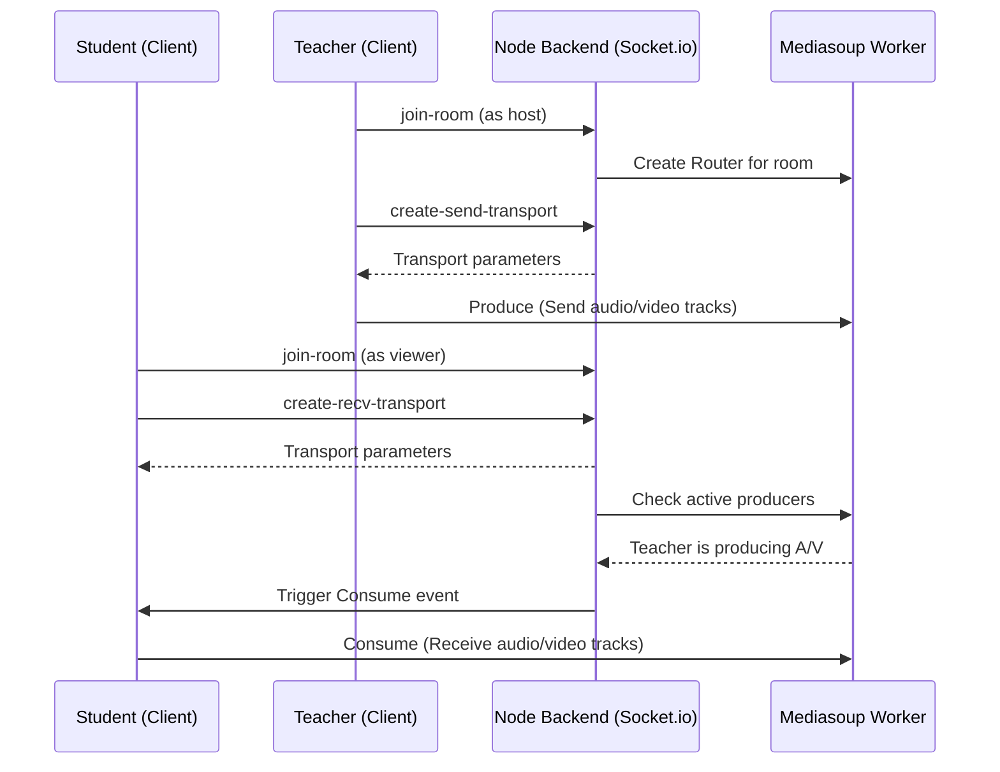

# System Architecture Specification: Zynk Edu

This document details the architectural layers, data flows, and workspace organization of **Zynk Edu**.

---

## 1. Monorepo / Workspace Organization

Zynk Edu is built as a JavaScript monorepo consisting of a separate Node.js backend server and a React frontend application.

```text
[project-root]/
├── apps/
│   ├── backend/               # Node.js + Express API & Mediasoup SFU
│   │   ├── certs/             # SSL Certificates for HTTPS/WSS (Mediasoup reqs)
│   │   ├── config/            # Server configs
│   │   ├── controllers/       # Route request handlers
│   │   ├── middleware/        # Authentication and authorization guards
│   │   ├── models/            # Mongoose (MongoDB) database schemas
│   │   ├── routes/            # REST API route endpoints
│   │   ├── sfu/               # Mediasoup Worker Pool & WebRTC logic
│   │   ├── sockets/           # Socket.io event controllers (SFU, Chat, Room, Poll)
│   │   ├── utils/             # Helper utilities (Cloudinary upload config)
│   │   └── server.js          # Express app and Socket.io server bootstrapping
│   └── frontend/              # Vite + React Client
│       ├── src/
│       │   ├── components/    # Reusable UI modules (Stream, Resource list, etc.)
│       │   ├── context/       # React Contexts (AuthContext)
│       │   ├── hooks/         # Custom React hooks
│       │   ├── pages/         # Page components (Classroom, Dashboard, Profile, Auth)
│       │   └── socket.js      # Socket.io client initialization
```

---

## 2. Core Architectural Components

* **API Layer (Express)**: Manages REST endpoints for user authentication, profile setups, classroom CRUD, resource library file operations, and meeting schedules.
* **Real-time Signalling & Coordination Layer (Socket.io)**: Manages room connection sockets, real-time classroom DMs/group chats, instant polling updates, and coordinates WebRTC room admissions.
* **Selective Forwarding Unit (Mediasoup SFU)**: High-performance WebRTC selective forwarding unit. Spawns node-based C++ subprocess workers to handle media pipes (audio/video tracks) directly, avoiding costly transcoding on the application thread.
* **Data Persistence Layer (MongoDB + Mongoose)**: Stores application state, documents, metadata, profiles, and relationships.
* **Storage Layer (Cloudinary)**: Offloads resource library file uploads (PDFs, templates, notes) to secure remote CDNs.

---

## 3. WebRTC Mediasoup Stream Flow



---

## 4. Key Architectural Patterns

### 4.1 Mediasoup Worker Pooling
* **Mechanism**: Spawns multiple physical Mediasoup C++ worker subprocesses (typically mapping to CPU cores). Each worker manages multiple routers (rooms). The server balances incoming room requests across the worker pool.
* **Purpose**: Scales multi-party real-time video conferences while preventing CPU bottle-necks on Node's single-threaded event loop.

### 4.2 Redis Session Store (Planned)
* **Mechanism**: Caches WebRTC transport configurations and Socket.io session IDs.
* **Purpose**: Allows quick socket reconnection without dropping the media streams or losing participant rosters.

### 4.3 Cloudinary CDN Offloading
* **Mechanism**: Intercepts file uploads via Mutler, sends them directly to Cloudinary cloud storage, and stores only the URL and metadata in MongoDB.
* **Purpose**: Keeps server instances stateless and ensures fast resource downloading for clients.
