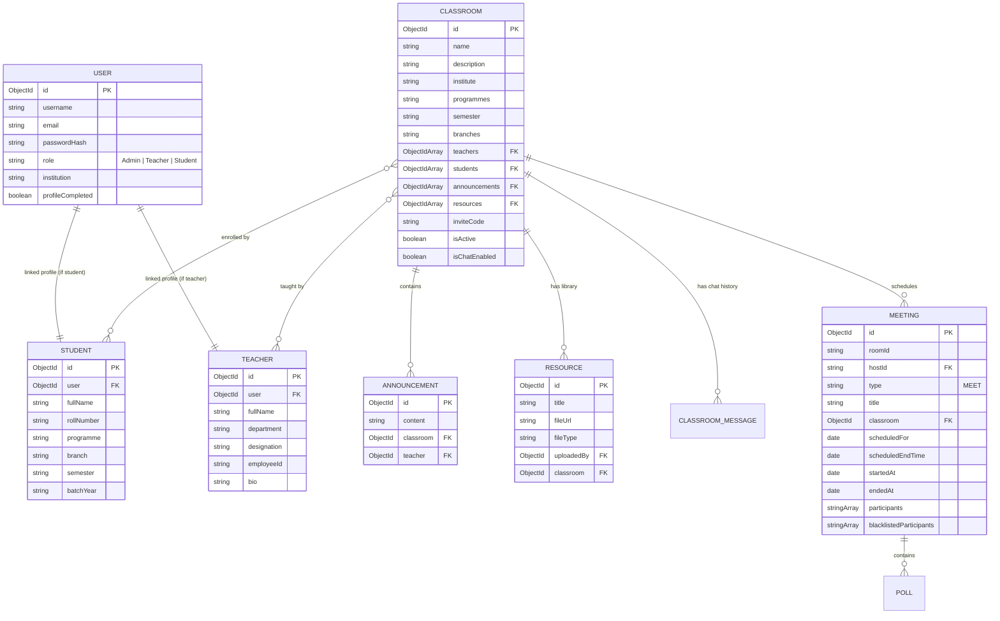

# Database Schema & Data Models Specification: Zynk Edu

This document details the MongoDB schema definitions, field validations, and relational mappings for **Zynk Edu** using Mongoose.

---

## 1. Entity-Relationship Diagram (ERD)

---

## 2. Model Definitions & Schemas

### 2.1 `User` Schema
* Represents authentication details.
* `email`: String (Unique, Indexed, Matches Regex).
* `password`: String (Hashed).
* `role`: String (Enum: `Admin`, `Teacher`, `Student`).
* `institution`: String (Required).
* `profileCompleted`: Boolean (Default: `false`).

### 2.2 `Student` Schema
* Contains metadata used by the smart eligibility system.
* `user`: ObjectId (Ref `User`, Unique).
* `fullName`: String (Required).
* `rollNumber`: String (Required).
* `programme`: String (Required).
* `branch`: String (Required).
* `semester`: String (Required).
* `batchYear`: String (Required).

### 2.3 `Teacher` Schema
* `user`: ObjectId (Ref `User`, Unique).
* `fullName`: String (Required).
* `department`: String (Required).
* `designation`: String (Required).
* `employeeId`: String (Optional).
* `bio`: String (Optional).

### 2.4 `Classroom` Schema
* `name`: String (Required).
* `description`: String.
* `institute`: String (Required, maps to user's institution).
* `programmes`: Array of Strings (Eligibility criteria).
* `semester`: String (Eligibility criteria).
* `branches`: Array of Strings (Eligibility criteria).
* `teachers`: Array of ObjectIds (Ref `Teacher`).
* `students`: Array of ObjectIds (Ref `Student`).
* `resources`: Array of ObjectIds (Ref `Resource`).
* `inviteCode`: String (Unique, Sparse).
* `isActive`: Boolean (Default `true`).
* `isChatEnabled`: Boolean (Default `true`).

### 2.5 `Meeting` Schema
* Represents active or scheduled video calls.
* `roomId`: String (Required, Unique, e.g., `xxx-yyyy-zzz`).
* `hostId`: String (Ref `Teacher` / Host user).
* `type`: String (Enum: `MEET`, Default `MEET`).
* `title`: String (Required).
* `classroom`: ObjectId (Ref `Classroom`).
* `scheduledFor`: Date.
* `scheduledEndTime`: Date.
* `startedAt`: Date (Default: `Date.now`).
* `endedAt`: Date (Nullable, set when ended).
* `participants`: Array of Strings (Socket or User IDs).
* `blacklistedParticipants`: Array of Strings.

### 2.6 `Resource` Schema
* `title`: String (Required).
* `fileUrl`: String (Required).
* `fileType`: String (Required).
* `uploadedBy`: ObjectId (Ref `User`).
* `classroom`: ObjectId (Ref `Classroom`).

---

## 3. Database Indexes & Optimizations

1. **User Index**: `email` field is indexed uniquely.
2. **Invite Code Index**: Sparse unique index on `inviteCode` to allow custom codes but ignore nulls.
3. **Classroom Search Index**: Compounds on `{ institute: 1, programmes: 1, semester: 1, branches: 1 }` to optimize smart eligibility checking in MongoDB queries.
4. **Active Meeting Index**: Index on `roomId` and compound index on `{ classroom: 1, endedAt: 1 }` to fetch current active meetings fast.
